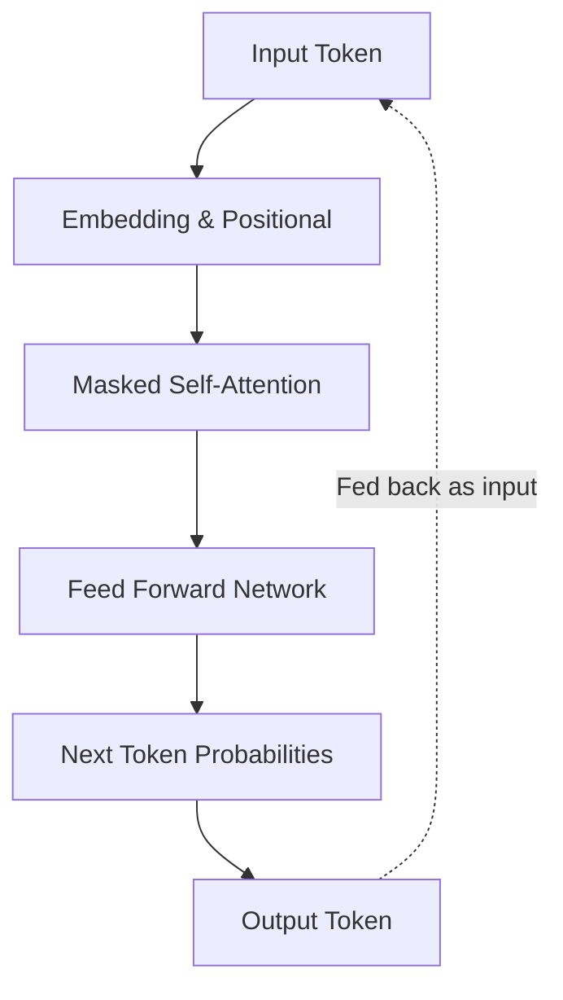
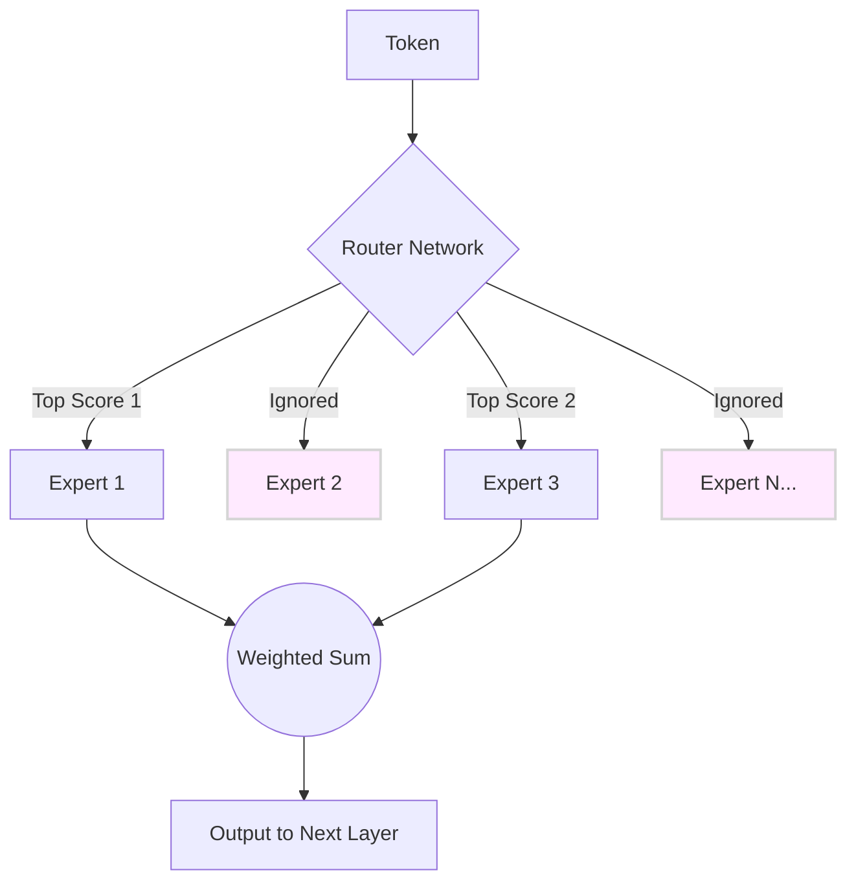

# Large Language Models: Important Architectures

The original 2017 Transformer architecture consisted of an **Encoder** and a **Decoder**. Over time, researchers realized that they didn't always need both parts depending on the specific NLP task. Furthermore, modern architectures have introduced sophisticated modifications to improve speed, memory, and reasoning.

---

## 1. High-Level Architecture Types

### 1.1 Decoder-Only Architectures (Generative Models)
This is the architecture powering almost all modern generative AI chatbots (like ChatGPT, Claude, LLaMA, and Mistral).
*   **How it works:** Trained on **Next Token Prediction**. They generate text auto-regressively.
*   **The Masked Self-Attention:** A crucial feature is the "causal mask." A token can only pay attention to previous tokens, never future tokens. This forces the model to actually learn to predict the future.

### 1.2 Encoder-Only Architectures (Understanding Models)
*   **How it works:** These models read the entire sequence in both directions simultaneously (bidirectional). Word 5 can pay attention to word 10. 
*   **Famous Models:** BERT, RoBERTa.
*   **Primary Use Cases:** Sentiment analysis, Semantic Search (creating embeddings for vector databases).

### 1.3 Encoder-Decoder Architectures (Sequence-to-Sequence)
*   **How it works:** The Encoder reads the input bidirectionally and creates a dense vector representation. The Decoder uses this to generate output auto-regressively.
*   **Famous Models:** T5, BART.
*   **Primary Use Cases:** Machine Translation, Summarization.

---

## 2. Deep Dive: The GPT Architecture

OpenAI's GPT (Generative Pre-trained Transformer) standardized the **Decoder-Only** approach. 

### Key Technical Choices:
*   **Pre-Layer Normalization:** GPT moved the `LayerNorm` to occur *before* the Attention and Feed-Forward blocks, which heavily stabilized training for deep networks.
*   **Activation Function:** Uses **GELU** (Gaussian Error Linear Unit) instead of ReLU. GELU is smoother and allows small negative values, helping gradient flow.
*   **Positional Encoding:** Originally used Absolute Positional Encodings (learned embeddings added to the input at the start).

---

## 3. Deep Dive: The LLaMA Architecture

Meta's LLaMA made several critical upgrades to the GPT baseline. Almost all modern open-source models (Mistral, Qwen) copy LLaMA's architecture because of its superior efficiency and performance.

### 3.1 RMSNorm (Root Mean Square Normalization)
Instead of standard `LayerNorm`, LLaMA uses `RMSNorm`. It normalizes the variance but ignores the mean centering. This makes it computationally faster while maintaining the same training stability.
$$RMS(x) = \sqrt{\frac{1}{d} \sum_{i=1}^{d} x_i^2 + \epsilon}$$

### 3.2 RoPE (Rotary Positional Embeddings)
Instead of adding absolute positions at the beginning, RoPE encodes position *multiplicatively* during the Attention calculation. It rotates the query and key representations in a complex plane. This gives the model a much better understanding of *relative* distance between words, which is crucial for handling very long context windows.

### 3.3 SwiGLU Activation Function
LLaMA replaces GELU with SwiGLU (Swish-Gated Linear Unit). It adds an extra gating mechanism to the Feed-Forward Network, which empirically provides better performance at the cost of slightly more parameters.
$$SwiGLU(x) = Swish_\beta(xW) \otimes xV$$

### 3.4 GQA (Grouped-Query Attention) - Introduced in LLaMA 2 & 3
Instead of Multi-Head Attention (where every Query head has its own Key and Value head), LLaMA groups multiple Query heads to share a single Key and Value head. This drastically reduces the memory bandwidth required during generation (specifically the KV Cache), making the model much faster during inference.

---

## 4. Deep Dive: Mixture of Experts (MoE)

Models like Mixtral 8x7B, Grok, and likely GPT-4 use a Mixture of Experts architecture to break the "Scaling Laws."

### The Problem with Dense Models
In a "Dense" model (like LLaMA-3-8B), every single parameter (weight) is used to process every single token. If you scale the model to 100 Billion parameters, it becomes too slow and expensive to run.

### The MoE Solution (Sparse Gating)
MoE replaces the giant Feed-Forward Network (FFN) in each Transformer block with multiple smaller FFNs called **Experts** (e.g., 8 experts).

1.  **The Router Network:** A small neural network (gate) calculates a probability distribution to decide which experts are best suited for the current token.
2.  **Top-K Routing:** The router only selects the Top 2 experts (for example). 
3.  **Sparsity:** The other 6 experts are completely ignored (multiplied by zero).

### The Math:
For a given token $x$, the router $G(x)$ outputs routing weights. If $E_i(x)$ is the output of expert $i$:
$$ y = \sum_{i \in \text{TopK}} G(x)_i \cdot E_i(x) $$

### The Advantage (Decoupled Compute)
A model like Mixtral 8x7B has 47 Billion total parameters (vast knowledge), but it only activates 14 Billion parameters per token. This provides the intelligence of a massive model with the inference speed of a small one.

### Load Balancing Loss
A common issue in MoE is that the Router becomes "lazy" and always routes tokens to the same 1 or 2 experts, leaving the others untrained. To fix this, MoE training includes an auxiliary **Load Balancing Loss** that mathematically penalizes the model if it doesn't distribute tokens evenly across all experts during training.
