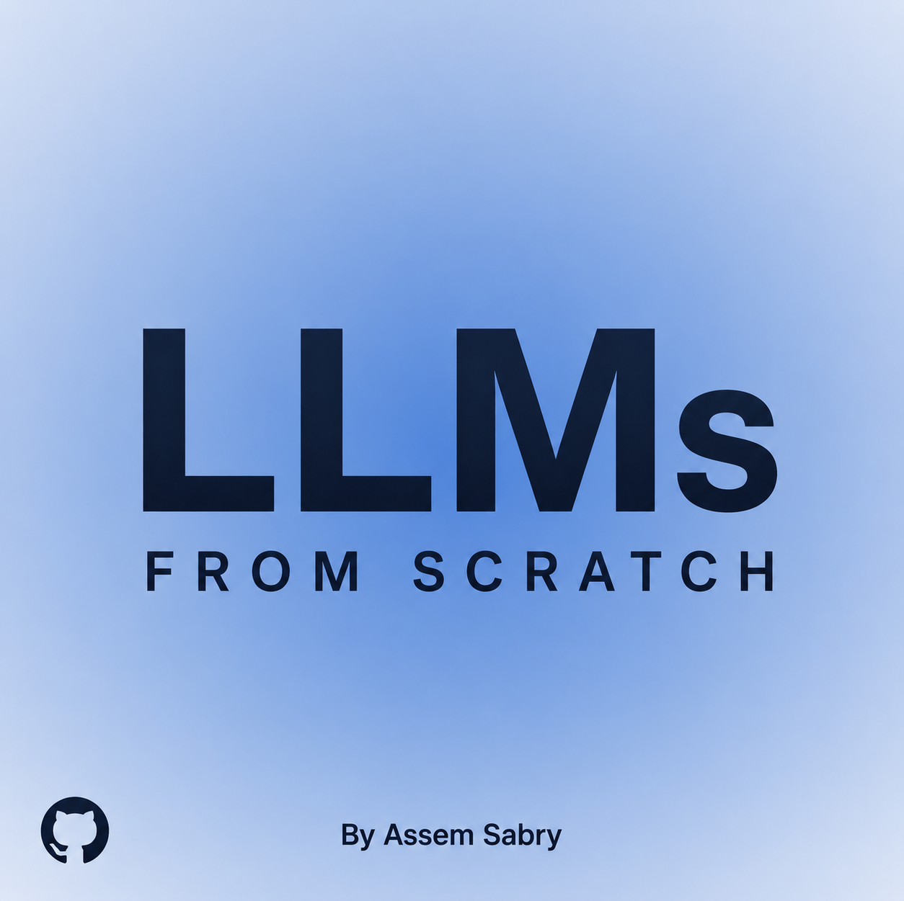
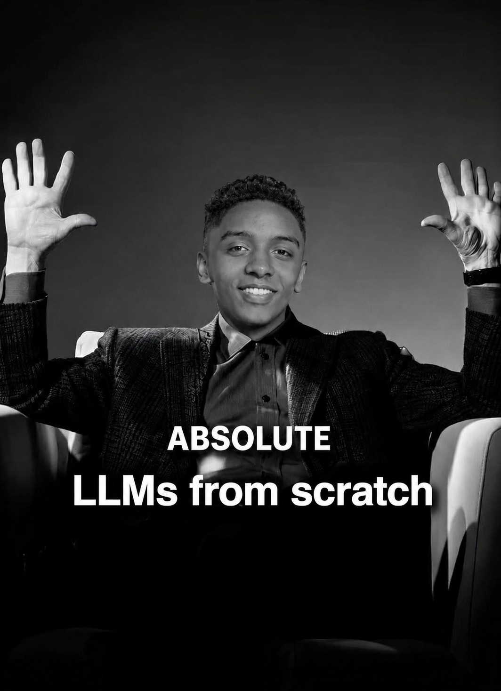

# LLMs from Scratch by Assem Sabry



## Mission

This repository exists for one main reason: to help people learn how large language models are built from scratch, by understanding the theory, reading the math, and then implementing the full pipeline themselves.

It is meant to be practical, not just inspirational. The goal is to move from "I use LLMs" to "I understand how to build one."

**Last updated:** August 13, 2026

## What This Repository Teaches

By working through this repository, you should be able to understand:

- the math foundations behind neural networks and transformers
- how tokenization works and why it matters
- how decoder-only LLMs are structured
- how pretraining pipelines are built
- how fine-tuning, LoRA, and PEFT fit into the full system
- how evaluation, inference, and deployment work in practice

This repository is structured to teach both:

1. the academic side of LLMs
2. the engineering side of LLMs

## Who This Is For

This repo is for:

- students learning AI, ML, NLP, and LLM engineering
- self-taught developers who want a serious roadmap
- researchers who want a compact educational reference
- builders who want to move from theory into implementation

If your goal is to actually build and understand an LLM yourself, this repo is for you.

## Repository Structure

The repository is organized into five theoretical tracks plus a practical implementation directory.

### Part 1: Educational Modules

A structured breakdown of AI and machine learning fundamentals, including:

- linear algebra, calculus, and probability
- machine learning and deep learning basics
- neural network architectures
- transformers and large language models
- tokenization, optimization, PEFT, quantization, and advanced topics

It also now includes a dedicated educational breakdown of the biggest AI trends from **May 13, 2026 to August 13, 2026**, so learners can connect fundamentals to the current frontier.

This part builds the conceptual base you need before writing serious LLM code.

### Part 2: Build Guide

A practical engineering roadmap for building an LLM step by step:

- dataset collection
- preprocessing and cleaning
- tokenizer training
- transformer implementation
- pretraining
- evaluation
- fine-tuning
- deployment

This section also includes a practical guide on how recent AI trends change the way modern LLM systems should be built.

This is the part to read when you want the full system view.

### Part 3: Machine Learning Master Plan

A wider roadmap that connects classical machine learning, deep learning, RLHF, deployment, and optimization into one learning path.

This part is useful if you want to understand where LLM engineering sits inside the bigger AI field.

### Part 4: Neural Networks Complete Guide

A focused guide on how neural networks work internally:

- perceptrons
- activation functions
- loss functions
- backpropagation
- optimization
- architecture evolution

This part is important because transformers make much more sense once the neural network fundamentals are strong.

### Part 5: Top AI Research Papers

A curated reading path across influential AI papers, from older breakthroughs to modern LLM and transformer work.

Use this section to connect implementation details to the research that shaped the field.

### Practical Implementation (`src/`)

The `src/` directory contains runnable code for the practical side of the repository:

- `src/data/` for dataset preparation and tokenization
- `src/model/` for from-scratch model components
- `src/train/` for training loops
- `src/finetune/` for LoRA and PEFT workflows
- `src/deploy/` for serving and inference APIs

## How To Use This Repository

The best way to study this repository is in this order:

1. Start with the theory in `Part_1_Educational_Modules`
2. Read `Part_4_Neural_Networks_Guide` to strengthen fundamentals
3. Move to `Part_2_Build_Guide` for the end-to-end LLM pipeline
4. Read the recent trends breakdown in `Part_1_Educational_Modules/16_Advanced_Topics/03_AI_Trends_May_to_Aug_2026.md`
5. Read the engineering translation in `Part_2_Build_Guide/08_Advanced_Topics_and_Summary/03_How_Recent_AI_Trends_Change_Your_LLM_Build.md`
6. Use `Part_3_Machine_Learning_Master_Plan` as your long-term roadmap
7. Study `Part_5_Top_AI_Research_Papers` to deepen your research understanding
8. Open `src/` and start implementing, running, and modifying code

The repository is designed to be both:

- a learning roadmap
- a working technical reference

## Quick Start

Clone the repository and install the dependencies:

```bash
git clone https://github.com/assemsabry/LLMs-from-scratch.git
cd LLMs-from-scratch
pip install -r requirements.txt
```

## Practical Usage

You can run the main pipeline stages from the project root:

```bash
# 1. Prepare and tokenize the dataset
python src/data/prepare_dataset.py

# 2. Train the model from scratch
python src/train/train_from_scratch.py

# 3. Fine-tune a pretrained model with LoRA
python src/finetune/lora_finetune.py

# 4. Serve the model as an API
python src/deploy/api.py
```

## YouTube Learning Roadmap

All external learning links below are YouTube links only.

### Community-Recommended Sources

These are strong YouTube-first resources for learners who want more explanations, more coverage, and more guided learning paths beyond the repository itself.

#### 1. IBM Technology

One of the best channels for staying up to date with AI trends while also learning core technical ideas in a simple and direct way. Their playlists regularly cover neural networks, LLM concepts, and new AI developments.

- Playlist: https://www.youtube.com/playlist?list=PLOspHqNVtKADfxkuDuHduUkDExBpEt3DF

#### 2. Harvard CS50's Artificial Intelligence

A strong long-form course from Harvard and freeCodeCamp that gives a broad AI foundation from A to Z. This is a good option for learners who want a structured introduction before going deeper into specialized LLM material.

- Full course: https://www.youtube.com/watch?v=5NgNicANyqM

#### 3. Generative AI Essentials by freeCodeCamp

A long-form course that covers a wide range of modern AI and generative AI topics. This is especially useful for learners who want a broader survey of current AI systems, workflows, and model-related topics in one place.

- Full course: https://www.youtube.com/watch?v=nJ25yl34Uqw

#### 4. NeuralNine

A practical channel focused on building projects, explaining neural networks clearly, and covering important AI trends in a simple, builder-friendly style.

- Playlists: https://www.youtube.com/@NeuralNine/playlists

#### 5. AI Revolution

A strong channel for following AI news, model releases, and fast-moving trends across the broader AI ecosystem.

- Channel: https://www.youtube.com/@airevolutionx

#### 6. Stanford Deep Learning Playlist

A full Stanford deep learning playlist associated with Andrew Ng. This is a strong foundation resource if you want a deeper neural network and deep learning background before going further into full LLM engineering.

- Playlist: https://www.youtube.com/playlist?list=PLoROMvodv4rNRRGdS0rBbXOUGA0wjdh1X

#### 7. freeCodeCamp

freeCodeCamp as a channel is one of the best general-purpose YouTube sources for long-form technical education, including AI engineering, machine learning, deep learning, Python, and practical tooling.

- Channel videos: https://www.youtube.com/@freecodecamp/videos

### 1. Stanford CS336: Language Modeling from Scratch

This is one of the strongest public resources if your goal is to understand how language models are built end to end. It covers tokenization, architectures, GPUs, kernels, scaling, evaluation, data, and alignment.

- Playlist: https://www.youtube.com/playlist?list=PLoROMvodv4rP8nAmISxFINlGKSK4rbLKh

### 2. Stanford CS25: Transformers United

This is excellent for learning transformers from researchers and engineers working close to the frontier. It is especially useful for building intuition around attention, transformer design, scaling, RAG, alignment, and modern transformer applications.

- Full playlist: https://www.youtube.com/playlist?list=PLoROMvodv4rNiJRchCzutFw5ItR_Z27CM
- Intro to Transformers with Andrej Karpathy: https://www.youtube.com/watch?v=XfpMkf4rD6E
- Intuition on LMs, Shaping the Future of AI: https://www.youtube.com/watch?v=3gb-ZkVRemQ

### 3. MIT 6.S191: Introduction to Deep Learning

This is a strong foundation course for people who still need to solidify deep learning basics before going deeper into LLM systems. It is especially helpful if you want a cleaner bridge from general deep learning into transformer and language model work.

- Intro to Deep Learning: https://www.youtube.com/watch?v=alfdI7S6wCY
- Deep Sequence Modeling: https://www.youtube.com/watch?v=LFuyODdoSUM

### 4. Stanford CS229: Building Large Language Models

This is a high-level but very useful lecture for understanding the real components involved in building LLMs in practice: pretraining, post-training, tokenization, evaluation, data quality, scaling laws, and systems concerns.

- Building Large Language Models: https://www.youtube.com/watch?v=9vM4p9NN0Ts

## Suggested Study Plan

If you are a beginner:

1. Start with MIT 6.S191
2. Then study Stanford CS25
3. Then move into Stanford CS336
4. After that, use this repository to rebuild the core components yourself

If you already know deep learning:

1. Start with Stanford CS25
2. Move directly to Stanford CS336
3. Use this repo side by side while implementing and testing concepts
4. Use Stanford CS229 to connect theory with real-world LLM engineering decisions

## Why This Repo Matters

A lot of people learn LLMs by only consuming tools, APIs, and frameworks. That creates users of AI, not builders of AI.

This repository is built for the second group.

Its purpose is to help more people understand:

- what is happening inside an LLM
- how training pipelines are designed
- how model quality is shaped by data, optimization, and architecture
- how to move from tutorials to real implementation

## Contributing

Contributions are welcome, especially if they improve:

- clarity of explanations
- educational structure
- implementation quality
- source quality
- hands-on examples

If you want to improve this repository, open an issue or submit a pull request.

## License

This project is open-source and free to use. If you redistribute, modify, or publish parts of it, you must attribute the original author and link back to this repository.



## Author

**Assem Sabry**  
AI Engineer & Researcher | Founder of TokenAI

- Assem Website: https://assem.one/
- TokenAI Website: https://tokenai.llc/
